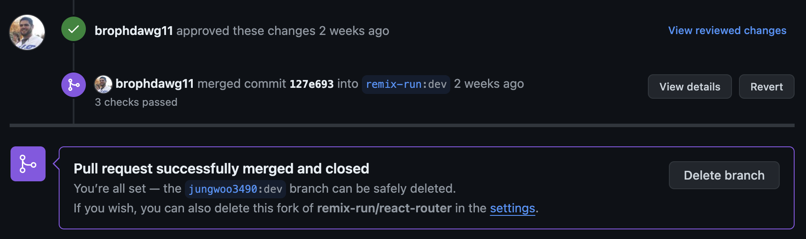
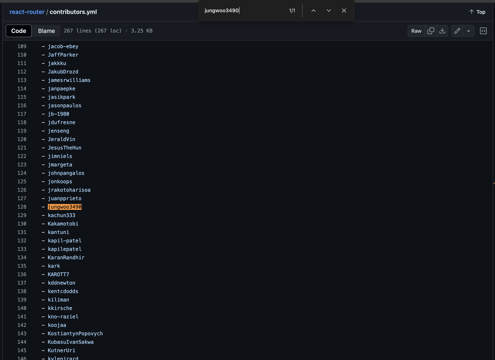
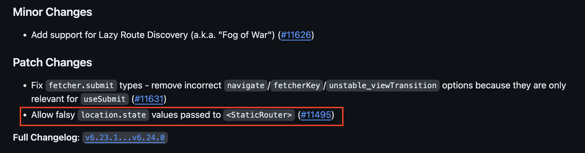

프로젝트 도중 다음과 같은 옵션 전환 모달 구현을 맡게 되었어요.

<video width="300" controls>
  <source src="https://github.com/jungwoo3490/jungwoo3490/assets/60962533/0352d842-4a62-4e66-b0b9-aca75ba48daf" type="video/mp4">
</video>

다음과 같이 모달을 눌렀을 때 현재 선택된 옵션이 아닌 다른 옵션들을 리스트 형식으로 보여줘야 했고, 그 옵션을 클릭하면 모달이 닫힘과 동시에 모달 텍스트가 내가 선택한 옵션으로 바뀌고, 모달을 다시 열면 동일하게 현재 선택된 옵션이 아닌 다른 옵션들을 리스트 형식으로 보여줘야 했어요.

다음과 같이 각 옵션을 0, 1, 2의 number값으로 관리하도록 시도했어요.
선택된 옵션은 부모 컴포넌트에서 관리하였으므로, 선택되지 않은 옵션값들을 filter 메소드를 활용하여 필터링하여 selectedModalOptionList prop으로 모달 컴포넌트에 넘겨주었어요.

```tsx
{
  modalOn && (
    <SelectModal
      modalOn={modalOn}
      closeModal={() => setModalOn(false)}
      selectOption={(option: number) => setSelectedOption(option)}
      selectedModalOptionList={[0, 1, 2].filter(num => num !== selectedOption)}
    />
  )
}
```

문제는 여기서 발생했어요. 이전 페이지에서 어떤 탭을 클릭하느냐에 따라 초기 선택 옵션값을 다르게 해야 했어요.

여기서 handleClickTab이 각 탭에 할당되는 클릭 이벤트 핸들러인데, 다음과 같이 즐겨찾기한 레큐북을 누르면 0, 내가 만든 레큐북을 누르면 1, 내가 남긴 레터를 누르면 2를 다음 페이지로 navigate함과 동시에 state 값으로 실어 보내려고 했어요.

```ts
const HistoryEnterList = useMemo(
  () => [
    {
      title: "즐겨찾기한 레큐북",
      variant: "book",
      image: <ImgMypageFavoriteLecueBook />,
      handleClickTab: () => navigate("/mypage/history", { state: 0 }),
    },
    {
      title: "내가 만든 레큐북",
      variant: "book",
      image: <ImgMypageMakeLecueBook />,
      handleClickTab: () => navigate("/mypage/history", { state: 1 }),
    },
    {
      title: "내가 남긴 레터",
      variant: "letter",
      image: <ImgMypageLetter />,
      handleClickTab: () => navigate("/mypage/history", { state: 2 }),
    },
  ],
  []
)
```

보낸 값을 useLocation으로 받아서 내 기록보기 페이지에서 선택된 옵션을 관리하는 state의 초기값으로 세팅해주었어요.

```tsx
const location = useLocation()

const [selectedOption, setSelectedOption] = useState<number>(location.state)
```

그런데, 문제가 발생했어요.

<video width="300" controls>
  <source src="https://github.com/jungwoo3490/jungwoo3490/assets/60962533/a292dd61-c1e0-4180-b821-3d677bc9eb88" type="video/mp4">
</video>

이렇게 "즐겨찾기한 레큐북"을 누를 때만 옵션이 제대로 선택이 되지 않았어요.<br/>
옵션 값이 어떻게 넘어오는지 확인하기 위해 내 기록보기 페이지에서 <code>selectedOption</code>을 console에 찍어본 결과, 신기한 일이 발생했어요.

<video width="600" controls>
  <source src="https://github.com/jungwoo3490/jungwoo3490/assets/60962533/3708fa83-2572-4467-9fa1-04ff8005a604" type="video/mp4">
</video>

다음과 같이 "즐겨찾기한 레큐북"을 눌렀을 때 0이 아닌 null값이 넘어가는 것을 확인했어요. 1, 2는 잘 넘어가는데 왜 0만 null로 넘어가지?? 의문이 들기 시작했어요.

```ts
handleClickTab: () => navigate("/mypage/history", { state: { option: 0 } }),
```

물론 위와 같이 state 값으로 number 값을 객체로 래핑해서 넘겨준 다음

```tsx
const [selectedOption, setSelectedOption] = useState<number>(
  location.state.option,
)
```

위와 같이 받을 때 해당 state 객체 프로퍼티에 접근해서 값을 받아오면 잘 받아와졌지만, 왜 state 값으로 단순 number 데이터를 넘겼을 때 다른 값이 아닌 0 값만 null로 넘어갈까에 대한 의문이 생겼고, useNavigate의 문제라고 생각하고 궁금증 해결을 위해 react-router 코드를 직접 뜯어보게 되었어요.

네비게이터 역할을 하는 함수 구조는 다음과 같았어요.

```tsx
let navigate: NavigateFunction = React.useCallback(
  (to: To | number, options: NavigateOptions = {}) => {
    warning(activeRef.current, navigateEffectWarning)

    // Short circuit here since if this happens on first render the navigate
    // is useless because we haven't wired up our router subscriber yet
    if (!activeRef.current) return

    if (typeof to === "number") {
      router.navigate(to)
    } else {
      router.navigate(to, { fromRouteId: id, ...options })
    }
  },
  [router, id],
)
```

별도의 처리 없이 스프레드 연산자로 options 값들을 실어보내고 있는 것을 확인할 수 있었어요.

options 타입 지정을 확인해보고자 NavigateOptions를 살펴보았어요.

NavigateOptions은 다음과 같았어요.

```ts
export interface NavigateOptions {
  replace?: boolean
  state?: any
  preventScrollReset?: boolean
  relative?: RelativeRoutingType
  unstable_flushSync?: boolean
  unstable_viewTransition?: boolean
}
```

state는 any 타입이었어요. 그렇다면 실제로 Navigator 측에서 별도의 state 처리를 안 했을 가능성이 높다고 생각했죠.

이때부터 저는 useNavigate가 아닌 useLocation에 문제가 있을 수도 있겠다는 생각을 하기 시작했어요.

살펴보던 중, StaticRouter 컴포넌트에서 location을 받아오는 코드를 발견하였고, 드디어 문제를 발견하게 되었어요.

```ts
let location: Location = {
  pathname: locationProp.pathname || "/",
  search: locationProp.search || "",
  hash: locationProp.hash || "",
  state: locationProp.state || null,
  key: locationProp.key || "default",
}
```

state를 받아올 때 locationProp.state가 falsy한 값이면 null로 처리하도록 되어있었어요.
0 값은 falsy한 값이기 때문에, 저 부분에서 null로 처리가 된 것이었어요.

이 부분은 분명한 버그라는 생각이 들었고, 다른 값은 잘 처리가 되는데 0만 처리가 안 되는 것은 분명 문제가 있다고 생각했어요.

이것은 분명히 좋지 못한 사이드 이펙트라는 생각이 들어 이 부분을 개선하고자 했습니다.

수정 작업은 크게 어렵지 않았어요. 다음과 같이 얕은 비교로 nullish한 값인지 비교해서 nullish한 값일때만 null로 넘기도록 수정해주었어요.<br/>
`??` 연산자를 사용하는 방법도 있었지만, 브라우저 호환성을 챙기기 위해 얕은 비교를 사용하게 되었어요.

```ts
let location: Location = {
  pathname: locationProp.pathname || "/",
  search: locationProp.search || "",
  hash: locationProp.hash || "",
  state: locationProp.state != null ? locationProp.state : null,
  key: locationProp.key || "default",
}
```

유닛 테스트 코드도 작성해주었어요.

```tsx
describe("with an object location prop", () => {
  // ...

  it("retains a non-null state when passed explicitly", () => {
    let location!: ReturnType<typeof useLocation>
    function LocationChecker() {
      location = useLocation()
      return null
    }

    ReactDOMServer.renderToStaticMarkup(
      <StaticRouter
        location={{ pathname: "/the/path", search: "?the=query", state: 0 }}
      >
        <Routes>
          <Route path="/the/path" element={<LocationChecker />} />
        </Routes>
      </StaticRouter>,
    )

    expect(location).toEqual({
      pathname: "/the/path",
      search: "?the=query",
      hash: "",
      state: 0,
      key: expect.any(String),
    })
  })
})
```

오래 기다린 끝에 Maintainer분께서 approve 및 Merge를 승인해주셨어요.



그렇게 저는 react-router의 기여자가 되었습니다 ⭐️



첫 오픈소스 기여였는데, 해외 개발자분들과 소통해야 해서 시차 문제 때문에 소통이 꽤나 힘들었었어요.<br />
하지만 분명히 좋은 경험이었고, 오픈소스 기여에 대한 두려움이 사라지게 되었어요.

앞으로도 다른 라이브러리에 많이 기여하여 개발자들의 생태계를 개선해야겠다고 다짐했어요.

++ 6/25일에 버그 개선한 부분이 6.24.0 버전에 릴리즈되었습니다!!


