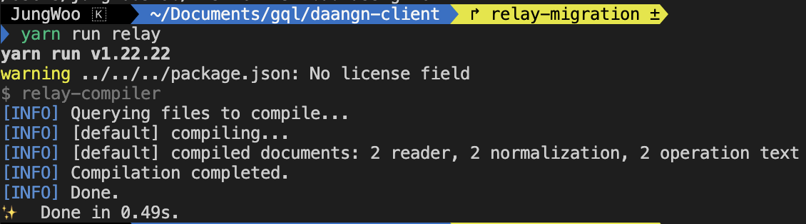
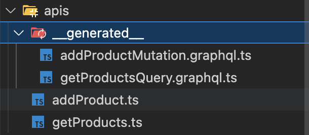
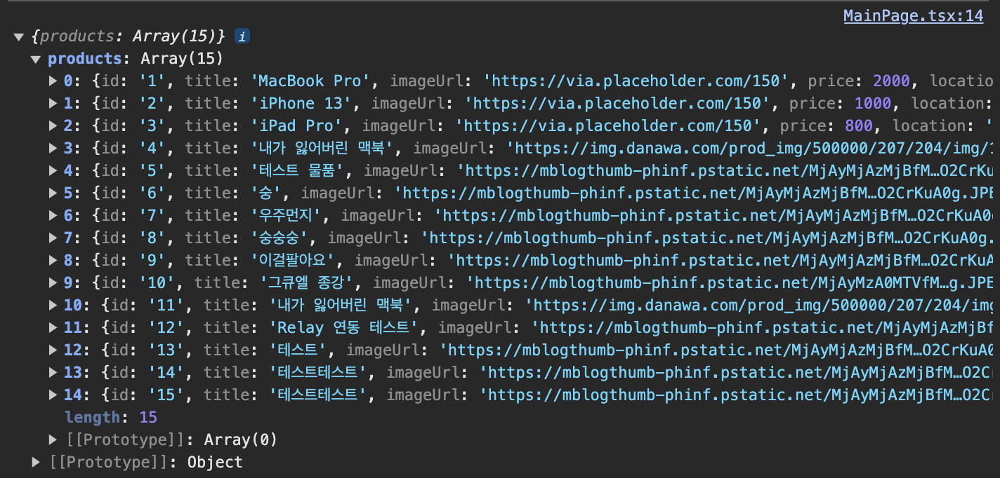

GraphQL을 공부하면서 실제 예제에 적용해보기 위해 서버 지인과 협업하여 당근마켓 중고거래 페이지 및 거래 품목 추가 페이지를 클론코딩해보았어요.

GraphQL 사용 자체가 처음이었기 때문에, 처음에는 비교적 러닝커브가 낮은 Apollo Client를 사용해서 개발했어요.
패키지 설치만 하면 따로 크게 추가 설정해줄 필요 없이 바로 사용이 가능해서 정말 편리했습니다.

Apollo Client는 공식문서에 사용 방법이 아주 잘 나와있으니 참고하면 좋아요.

## 기존 Apollo Client 사용한 구현 과정

```ts
const client = new ApolloClient({
  uri: "{서버 엔드포인트}",
  cache: new InMemoryCache(),
})
```

먼저 <code>ApolloClient</code> 인스턴스를 생성해주었어요. uri에는 서버 엔드포인트 주소를 지정하였고, cache에 <code>InMemoryCache()</code>를 사용하여 메모리 기반의 캐시를 생성해주었어요.

```tsx
return (
  <ApolloProvider client={client}>
    <RouterProvider router={router} />
  </ApolloProvider>
)
```

애플리케이션 최상위 컴포넌트를 <code>ApolloProvider</code> 컴포넌트로 감싸고, <code>ApolloProvider</code> 컴포넌트에 위에서 생성한 Apollo Client 인스턴스인 <code>client</code>를 전달하여 Apollo Client의 기능을 전역으로 제공하도록 해주었어요.

다음은 제품 목록을 가져오는 부분이애요. <code>Products</code>라는 GraphQL 쿼리를 정의하였고, <code>useQuery</code>를 사용하여 정의한 <code>GET_PRODUCTS</code> 쿼리를 실행하여 서버로부터 데이터를 받아왔어요.

```ts
const GET_PRODUCTS = gql`
  query Products {
    products {
      id
      title
      imageUrl
      price
      location
      uploadDate
    }
  }
`

const { loading, error, data } = useQuery(GET_PRODUCTS)
```

다음은 제품을 추가하는 부분입니다. <code>addProduct</code>라는 GraphQL의 mutation을 정의하였고, <code>useMutation</code>에서 <code>refetchQueries</code> 옵션을 설정해주어 제품을 추가하고 나서 제품 목록 데이터를 새로 갱신하도록 해주었어요.

폼을 제출하면 호출되는 <code>handleSubmit</code> 함수에서 <code>mutationFn</code>을 호출하여 mutation을 실행해 제품을 추가하도록 했어요. <code>variables</code>를 통해 mutation에 필요한 추가할 제품에 대한 데이터들을 전달해주었습니다.

```ts
const ADD_PRODUCT = gql
    mutation AddProduct(
      $title: String
      $imageUrl: String
      $price: Int
      $location: String
    ) {
      addProduct(
        title: $title
        imageUrl: $imageUrl
        price: $price
        location: $location
      ) {
        id
        title
        imageUrl
        price
        location
        uploadDate
      }
    }
  ;

  const [mutationFn, { loading, data, error }] = useMutation(ADD_PRODUCT,  {
    refetchQueries: [{ query: GET_PRODUCTS }],
  });

  const handleSubmit = (e) => {
    mutationFn({ variables: values });
    navigate("/");
  };

```

Apollo를 사용해서 구현하고 나니, Relay도 경험해보고 싶은 욕심이 생겼어요. 그래서 Relay로 마이그레이션을 시도해보기로 했어요.

그 과정에서 시행착오도 아주 많았고, 성공한 과정을 중점적으로 기록하려고 해요.

## Relay로 마이그레이션

### 1. 스키마 파일 생성

<code>/src/schema/schema.graphql</code>에 다음과 같이 스키마를 추가해주었어요. 이 스키마는 서버에서 정의한 스키마와 동일한 구조로 세팅해주어야 해요.

```graphql
type Product {
  id: ID!
  title: String!
  imageUrl: String
  price: Float!
  location: String!
  uploadDate: String!
}

type Query {
  products: [Product]
}

type Mutation {
  addProduct(
    title: String
    imageUrl: String
    price: Int
    location: String
    content: String
  ): Product
}
```

### 2. Relay 컴파일러 세팅

GraphQL 쿼리를 컴파일하기 위한 Relay 컴파일러를 설치해줍니다.

```sh
yarn add --dev relay-compiler
```

그리고, <code>package.json</code> script에 다음과 같이 세팅해줍니다.

```json
"scripts": {
  "relay": "relay-compiler"
}
```

### 3. Relay 컴파일러 설정파일 추가

프로젝트 root 경로에 <code>relay.config.json</code> 파일을 만들고 다음과 같이 작성해주었어요.

```json
{
  "src": "./src",
  "schema": "./src/schema/schema.graphql",
  "language": "typescript"
}
```

각 옵션값은 다음을 의미해요.

• **src**: Relay 컴파일러가 소스 코드를 검색할 디렉토리에요. 프로젝트 내의 모든 소스 파일들이 src 폴더 내에 위치했으므로, ./src로 지정해주었어요.<br/>
• **schema**: GraphQL 스키마 파일의 위치예요. 1에서 생성한 파일 경로를 지정하면 됩니다.<br/>
• **language**: 사용 언어를 지정해요. TS로 개발했으므로 typescript로 지정하면 돼요.<br/>

이렇게 해두면 이후에 <code>yarn run relay</code> 명령을 통해 GraphQL 쿼리 파일을 컴파일할 수 있어요.

### 4. babel-plugin-relay 세팅

Relay는 GraphQL 쿼리를 실행 시에 사용할 수 있는 코드로 변환해야 하는데, 이 변환 작업을 <code>babel-plugin-relay</code>가 담당해요.

다음 명령어로 Babel 플러그인과 GraphQL 라이브러리를 설치해줍니다.

```sh
yarn add --dev babel-plugin-relay graphql
```

그 후 <code>.babelrc</code> 파일에 다음과 같이 relay 플러그인을 추가해줍니다.

```json
{
  "plugins": ["relay"]
}
```

### 5.GraphQL 쿼리 파일 작성

서버로부터 데이터를 가져오기 위한 GraphQL 쿼리를 정의하는 파일을 생성해줍니다.

제품 목록을 가져오는 query, 제품을 새로 등록하는 mutation 쿼리 파일을 각각 생성해주었어요.

```ts
// getProducts.ts
// 물품 목록을 가져오는 query
import { graphql } from "react-relay"

const getProducts = graphql`
  query getProductsQuery {
    products {
      id
      title
      imageUrl
      price
      location
    }
  }
`

export default getProducts
```

```ts
// addProduct.ts
// 물품을 새로 등록하는 mutation
import { graphql } from "react-relay"

const addProduct = graphql`
  mutation addProductMutation(
    $title: String
    $imageUrl: String
    $price: Int
    $location: String
  ) {
    addProduct(
      title: $title
      imageUrl: $imageUrl
      price: $price
      location: $location
    ) {
      id
      title
      imageUrl
      price
      location
      uploadDate
    }
  }
`

export default addProduct
```

### 6. GraphQL 쿼리 컴파일

쿼리 파일까지 잘 작성해주었다면, 다음 명령어를 통해 relay 컴파일러를 실행하여 GraphQL 쿼리를 컴파일하면 돼요.

```sh
yarn run relay
```

성공적으로 컴파일되었다면, 다음과 같은 성공 로그가 뜨고,



쿼리 파일이 위치한 경로에 <code>\_\_generated\_\_</code> 라는 폴더가 생성되면서 폴더 내부에 컴파일된 쿼리가 생성되게 돼요.



### 7. Relay Environment 설정

<code>src</code> 경로에 Relay Environment를 설정하기 위한 파일을 만들어주었어요.

```ts
import { Environment, Network, RecordSource, Store } from "relay-runtime"

const source = new RecordSource()
const store = new Store(source)

const network = Network.create((operation, variables) => {
  const graphqlEndpoint = "{서버 엔드포인트}"

  return fetch(graphqlEndpoint, {
    method: "POST",
    headers: {
      "Content-Type": "application/json",
    },
    body: JSON.stringify({
      query: operation.text,
      variables,
    }),
  }).then(response => {
    return response.json()
  })
})

const handlerProvider = null

const environment = new Environment({
  handlerProvider,
  network,
  store,
})

export default environment
```

각 부분은 다음과 같아요.

#### ※ RecordSource & Store 설정

```ts
const source = new RecordSource()
const store = new Store(source)
```

<code>RecordSource</code> 객체를 생성하여 Relay가 관리하는 데이터 소스를 설정하고, 이 소스를 바탕으로 <code>Store</code> 객체를 생성해요.<br/>
<code>Store</code> 객체는 클라이언트 측의 데이터 캐시 역할을 합니다.

#### ※ Network 설정

```ts
const network = Network.create((operation, variables) => {
  const graphqlEndpoint = "{서버 엔드포인트}"

  return fetch(graphqlEndpoint, {
    method: "POST",
    headers: {
      "Content-Type": "application/json",
    },
    body: JSON.stringify({
      query: operation.text,
      variables,
    }),
  }).then(response => {
    return response.json()
  })
})
```

<code>graphqlEndpoint</code>를 서버의 엔드포인트로 지정해주면 돼요.<br/>
지정한 엔드포인트에서 데이터를 fetch해서 json 형식으로 변환하게 됩니다.

여기서 <code>method</code>가 <code>POST</code>로 고정된 이유는 GraphQL은 단일 엔드포인트에서 여러 종류의 요청을 처리해야 하기 때문에 일반적으로 <code>POST</code> 방식을 사용해서 query와 mutation을 처리하기 때문이에요.

#### ※ Handler Provider 설정

```ts
const handlerProvider = null
```

Relay의 Handler를 제공할 때 사용하는 변수인데, 따로 사용이 필요하지 않아 <code>null</code>로 설정해주었어요.

#### ※ Environment 설정

```ts
const environment = new Environment({
  handlerProvider,
  network,
  store,
})
```

Environment 클래스를 사용하여 Relay 환경을 설정했어요. 인자로 <code>handleProvider</code>, <code>network</code>, <code>store</code> 설정값을 주어 Relay가 GraphQL 요청을 처리하고 데이터를 캐시하는 데 필요한 모든 구성 요소를 포함시키게 돼요.

### 7. 전역으로 Relay 환경설정 제공

App.tsx에서 <code>RelayEnvironmentProvider</code> 컴포넌트를 통해 위에서 설정했던 환경설정을 전역으로 제공하도록 세팅해주었어요.

```tsx
function App() {
  const router = createBrowserRouter([
    { path: "/", element: <MainPage /> },
    { path: "/add", element: <AddPage /> },
  ])

  return (
    <RelayEnvironmentProvider environment={environment}>
      <RouterProvider router={router} />
    </RelayEnvironmentProvider>
  )
}
```

### 8. GraphQL query 통신

GraphQL query를 통해 전체 상품 목록을 받아와봅시다.

Relay에서 제공하는 <code>useLazyLoadQuery</code>를 사용해서 데이터를 받아올 수 있어요.

```ts
const data = useLazyLoadQuery(getProductsQuery, {})
```

첫 번째 인자로 실행할 GraphQL 쿼리를 정의한 객체를 전달하면 돼요.<br/>
두 번째 인자로는 쿼리에 전달할 변수를 포함하는 객체를 전달하는데, 현재 쿼리에 변수가 없으므로 빈 객체를 전달했어요.

실제로 데이터가 잘 받아와진 것을 확인할 수 있어요.



### 9. GraphQL mutation 통신

먼저 <code>useMutation</code> hook을 사용하여 <code>addProduct</code> mutation을 실행하는 함수 <code>commitAddProduct</code>을 생성했어요.

```ts
const [commitAddProduct] = useMutation(addProduct)
```

그 후, 폼 제출시 실행할 <code>handleSubmit</code> 함수를 다음과 같이 정의해주었어요.

```ts
const handleSubmit = e => {
  commitAddProduct({
    variables: { ...values },
    onCompleted: () => {
      navigate("/")
    },
    onError: e => {
      console.log(e)
    },
  })
}
```

<code>handleSubmit</code>은 <code>commitAddProduct</code> 함수를 호출하여 <code>addProduct</code> mutation을 실행해요.
여기서, mutation에 전달할 변수가 존재하므로, <code>variables</code> 속성에 폼에서 수집한 <code>values</code> 객체 state의 프로퍼티들을 전달해주었어요.

<code>onCompleted</code> 콜백 함수는 mutation이 성공적으로 완료된 후에 호출돼요. 물품을 성공적으로 추가하면 홈 화면으로 이동하도록 해주었어요.

<code>onError</code> 콜백 함수는 mutation이 에러를 반환할 때 호출돼요. 별도의 에러페이지가 없어서 console에 에러를 로깅하도록 위와 같이 설정해주었는데, 실제론,ㄴ 별도의 에러페이지를 만들어 에러페이지로 리다이렉트하도록 예외처리를 해주는 게 좋을 것 같다는 생각을 했습니다.

### 캐시 데이터 대신 최신 데이터 받아오기

통신은 잘 됐는데, 다음과 같이 제품을 등록하고 홈 화면으로 이동하면 추가한 제품이 반영이 안 되어있고, 새로고침을 해야 반영되는 문제가 있었어요.

<video width="300" controls>
  <source src="https://github.com/jungwoo3490/jungwoo3490/assets/60962533/2221e194-7368-4189-b60a-c05052fb5720" type="video/mp4">
</video>

<br />
<br />

Relay에서는 기본적으로 데이터를 클라이언트 측에 캐싱해요.

캐시 데이터를 사용하기 때문에 위 화면과 같이 제품을 성공적으로 등록하고 홈 화면으로 이동해도 제품 목록에 바로 뜨지 않고 새로고침을 해야 반영되는 것이었어요.

Apollo Client에서는 이 문제를 <code>refetchQueries</code>를 통해 mutation 후에 데이터를 갱신하도록 하여 해결했는데, Relay에서는 어떻게 하면 될까요?

여러 방법이 있을 수 있지만, 나는 <code>useLazyLoadQuery</code>의 <code>fetchPolicy</code>를 <code>'network-only'</code>로 설정하여 항상 새로운 데이터를 네트워크에서 가져오도록 해서 해결했어요.

```ts
const data = useLazyLoadQuery(
  getProductsQuery,
  {},
  { fetchPolicy: "network-only" },
)
```

이렇게 설정해준 결과, 제품을 성공적으로 등록하고 홈 화면으로 이동하면 방금 추가한 제품이 목록에 바로 반영되는 것을 확인할 수 있었습니다.

<video width="300" controls>
  <source src="https://github.com/jungwoo3490/jungwoo3490/assets/60962533/e485e394-23e4-41ad-a33c-67eee9f36d79" type="video/mp4">
</video>
