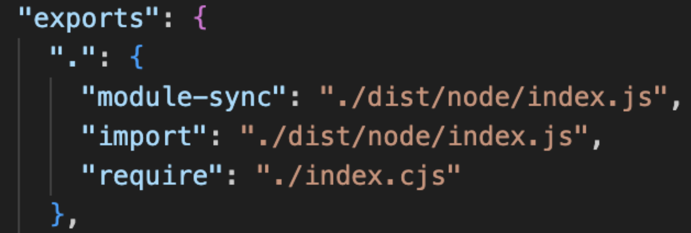

회사에 신규 팀원이 합류해서 프로젝트를 clone하고 의존성을 설치하고 개발서버를 열려고 스크립트를 실행했는데, 오류가 발생했다는 제보를 받았어요.

오류 메시지는 다음과 같았어요.

어라 난 require를 쓴 적이 없는데...??? 
원인 파악을 위해 제 로컬에서 돌려봤어요. 문제없이 로컬서버가 잘 돌아갔죠.

## require는 어디서 튀어나온 녀석일까...?

`.js` 파일이 어떤 모듈 시스템을 사용할지는 `package.json`의 `type` field에 따라 결정돼요. 
`type` field를 별도로 지정하지 않으면 default 값은 `"commonjs"`이고, CJS 형식으로 해석되어요. 
다른 하나의 옵션은 `"module"`이에요. 이럴 경우 ESM 형식으로 해석되어요.

`.ts` 파일은 TypeScript 4.7 버전부터 `tsconfig.json`의 `moduleResolution` 필드가 `nodenext` 또는 `node16` 으로 설정된 경우 위에 서술한 규칙이 똑같이 적용되게 돼요.

당시 Vite config 파일의 확장자가 `.ts`였는데, 이것저것 마이그레이션하는 과정에서 type field 지정을 빼먹게 되어서 .ts 파일이 CJS 형식으로 해석되어서 require("vite")와 같은 형태가 되게 돼요.

Vite 공식문서를 보면 다음과 같이 vite는 6버전부터 모든 모듈을 ESM으로 지원한다고 서술되어 있어요. 

사용하는 Vite 버전은 6버전이었고, 그럼 Vite는 ESM으로 export되는데 이걸 require로 가져오려 해서 오류가 발생했구나!! 라고 생각했어요. (어찌보면 일부는 맞고 일부는 틀린 생각이었어요)

그래서 `package.json`의 `type` 필드에 `"module"`을 적용해주었어요. 그러면 ESM으로 내보낸 모듈을 import로 가져오니까 문제될게 없겠죠?? 실제로 문제가 말끔히 해결됐어요. 
아니면 명시적으로 Vite config 파일의 확장자를 `.mts`로 지정해주어도 해결이 됩니다.

## 왜 Node 버전을 올렸는데 에러가 생긴 걸까...?

하지만 여기서 의문이 생깁니다.

저는 Node 22.10.0 버전을 사용하고 있었고, 프로젝트 환경은 Vite 6 + Yarn PnP 4.5.3 버전을 사용하고 있었어요. 
신규 팀원분도 모든 버전 세팅이 동일했어요. Node 버전을 제외하고요.

신규 팀원분이 오셨을 때 Node LTS 버전이 22.14.0 버전이었고, 팀원분은 LTS 버전을 설치해서 22.14.0 버전을 사용하고 있었어요.

그럼 22.10.0에서도 오류가 발생해야 하는거 아니야...?

마이너 버전을 하나씩 올려가며 어느 기점부터 에러가 발생하기 시작하는지 살펴본 결과, 22.11.0 -> 22.12.0 기점부터 에러가 발생하기 시작했어요.

22.12.0 패치노트를 살펴봤을 때, 이런 내용을 발견하게 되었어요.

`require(esm)`을 default로 지원하게 되었다는데, 기존엔 지원되지 않았던 걸까요?? 왜 `require(esm)`은 실험적인 기능이었을까요?? 

이를 이해하려면 CJS와 ESM 모듈을 Node.js가 어떻게 로드하는지에 대한 이해가 필요해요.

## CJS vs ESM

ESM이 등장하기 전 Node 진영에서는 CJS라는 모듈 시스템을 사용하고 있었어요.

CJS는 `require`/`module.exports`로 모듈을 내보내고 불러와요.

Node는 CJS 모듈을 로드하기 위해 CJS 모듈 로더를 사용하는데, CJS 모듈 로더는 런타임에 require문을 만나면 그제서야 이 모듈을 동적으로 로드하고 실행해요.

이런 동적 모듈 로딩 방식에는 한계점이 있었어요. 
먼저 성능 문제였어요. 서버사이드에서는 모든 파일이 로컬에 있어서 로드하는 데 성능 이슈가 크게 문제되지 않았지만, 브라우저에서는 필요한 모듈을 모듈이 위치한 곳에서 모두 내려받을 때까지 아무것도 할 수 없었어요. 
또 tree-shaking을 할 수 없었어요. 미리 모듈 사이의 연관관계를 분석해야 사용되지 않는 모듈을 파악하고 tree-shaking이 가능한데, 런타임에 require문을 만났을 때 동기적으로 모듈을 로드하기 때문에 이런 연관관계를 런타임 전에 미리 분석할 수가 없었기 때문이에요.

하지만 ESM은 빌드 타임에 정적으로 모듈을 분석해서 의존성 트리를 만들어요. 즉, 런타임 이전에 모듈간의 의존성을 미리 파악할 수 있게 되고, 이로 인해 tree-shaking도 가능해지죠.

더 깊게 알아볼까요?? ESM이 브라우저에서 동작하기 위해서는 모듈 레코드라는 자료구조로 변경이 되어야 하는데, 이런 모듈화 과정은 구성(construction), 인스턴스화(instantiation), 평가(Evaluation)의 3단계로 이루어져요. 

구성(construction) 단계는 esm loader가 entry point부터 시작하여 모든 모듈 파일을 로드, 파싱하여 모듈 레코드로 변환하고, 모듈 맵에 추가해요.

인스턴스화(instantiation) 단계는 모듈 인스턴스들을 메모리에 연결하는 단계에요. JS 엔진이 모듈 레코드의 변수를 관리하는 모듈 환경 레코드를 생성하고, 모든 export된 값을 배치하기 위한 메모리 공간을 찾아요. 모든 export 연결을 마무리하면 해당 모듈에서 import 한 항목들을 export들과 연결해요. 이 과정을 통해 동일 모듈에 대한 export와 import는 같은 메모리의 주소를 가리키게 돼요.

평가(Evaluation) 단계에서는 코드를 실행하여 메모리를 변수의 실제 값으로 채우는 단계예요.

이렇게 cjs와 esm이 동작하는 메커니즘과 로더가 완전 다르기도 하고, require(esm)을 하지 못하는 가장 큰 이유는 ESM에서 지원하는 top-level await이라는 기능 때문이에요.

기존에 await를 사용하려면 async 함수 스코프 내부에 가둬서 사용을 해야 했는데, ESM에서는 top level에서 async 없이 await을 호출할 수 있어요. 하지만 이 기능을 CJS에서는 지원하지 않았기 때문에 `require(esm)`은 이론상 불가능하게 됐어요.

Node 22.12.0 이전 버전까지는 `require(esm)`은 실험적 기능이었고, 특정 플래그를 통해서만 사용할 수 있었어요. 하지만 22.12.0부터 require(esm) 기능이 default로 동작하게 되었어요.

## 끝없는 의문

22.12.0부터 `require(esm)`을 지원했구나!!! 여기까지는 이해했어요.

그런데 까면 깔수록 더욱 이상해집니다... 그럼 22.12.0 이하 버전에서는 에러가 나야 하고, 22.12.0부터 되어야 하는 거 아닌가...?

지금은 이와 완전 반대인 상황이에요. 대체 왜 이런 상황이 발생한 걸까요??

## Vite의 Dual package export 방식

package.json의 exports field를 활용하면 동일한 import path에 대해 특정 조건에 따라 다른 모듈을 제공할 수 있어요. 이를 Dual Package라고 칭해요.

Vite의 export 필드를 확인해보았는데, 정확히 Dual Package 방식으로 동작하고 있었어요.

require로 vite를 가져오면 `index.cjs`, 즉 CJS 모듈을 내보내고, import로 가져오면 esm 모듈을 내보내요. 
즉, vite는 무조건 ESM만 제공하는게 아니라, CJS, ESM 두 방식에 대해 모두 대응을 하고 있었어요. 6버전이 됐음에도 불구하구요.

실제로 코어 함수들은 모두 `node/index.js`에 ESM으로 작성되어 있어요. 그러면 `index.cjs` 내부는 어떻게 구성되어 있을까요??

먼저 warnCJSUsage() 를 호출해요. 처음에 22.11.0에서 뜬 warning 문구가 이 함수 호출로 인해서 뜨게 된 것이었어요.

핵심 로직은 이 부분이에요.

`index.cjs`에서 먼저 ESM에서 제공하는 함수들을 미리 정의만 해둔 뒤, ESM Vite 모듈을 동적 import로 가져온 뒤 가져온 모듈에서 미리 정의해둔 함수들에 실제로 매핑하게 돼요.  결국 코어 함수는 ESM에서 제공하지만, CJS에서 이를 짜맞추기 방식으로 가져와서 매핑해서 제공하는 방식으로 CJS 환경에서도 동작하도록 호환성을 보장했던 것이었죠.

그래서 22.11.0에서 `require("vite")`로 가져오면 CJS Vite가 가져와져서 경고는 뜨지만, 정상적으로 동작했던 것이었어요. 의문이 하나 풀렸네요!!

그런데 해결되지 않은 다른 의문이 있습니다. 22.12.0부터 `require(esm)`을 제공하긴 하지만, 어차피 require로 받아온거니까 위 export field에 따르면 `index.cjs`가 받아져서 경고만 뜨고 정상 구동되어야 하는거 아닐까요??

다시 위로 가서 export 필드를 보면, 익숙한 `import`, `require` 말고도 `module-sync`라는 낯선 친구가 있습니다. 이 친구는 뭐 하는 친구일까요??

vite는 공식적으로는 ESM을 지원해요. 현재는 CJS -> ESM으로 넘어가는 과도기이고, 그렇기에 Dual export를 아직까지는 제공하지만, 추후 deprecated될 확률이 높아요.

Node에서도 안정적인 마이그레이션을 위해 `require(esm)`을 지원하기 시작한 것이라는 생각이 들어요. Node 22.12.0부터는 어차피 `require(esm)`을 지원하는데, Vite에서 굳이 require라는 이유로 비공식적인 CJS를 지원할 필요가 있을까요??

실제로 Vite 팀에서 같은 생각을 했고, module-sync라는 필드를 만들었어요. Node가 `require(esm)`을 지원하는 버전이라면 (> 22.12.0) `module-sync`에 해당되고, 이때는 `require`/`import` 구분 없이 모두 ESM 모듈을 내보내게 돼요.

하지만 esm으로 내보내졌더라도, Node에서 require(esm)을 지원하기 때문에 에러가 발생하지 않아야 해요. 근데 왜 발생하고 있는 걸까요?? 원인은 Yarn PnP에 있었어요.

## Yarn PnP의 모듈 로드 방식

Node의 module loader는 기본적으로 `node_modules`에서 모듈을 찾도록 설계되어 있어요. 하지만 pnp는 `node_modules`가 존재하지 않아요. pnp.cjs를 기반으로 모듈을 resolution하고 load하게 되죠. 이게 어떻게 가능할까요??

Yarn PnP는 resolve 단계에서 `pnp.cjs`를 통해 모듈을 찾게 하기 위해 Node.js의 `Module.\_resolveFilename`이라는 module을 resolve하는 메소드를 monkey-patch하여 사용하고 있어요.

하지만 Yarn 4.5.3에서 patch한 CJS loader에서 `require(esm)`을 지원하지 않았어요. 결국 Node는 지원을 하지만, Yarn PnP에서 패치한 module loader에서 `require(esm)`에 대한 지원이 없어서 발생한 문제였어요.

이는 다행히도 yarn 4.6.0에서 지원을 시작했어요. 
어떻게 지원을 하게 되었는지 궁금해서 찾아봤는데 다음과 같은 조건문으로 `require(esm)` 에러 여부를 제어하고 있었어요.

`process.features.require_module`이 뭘까?? 궁금해서 찾아봤는데, 다음과 같이 Node에서 `require(esm)`을 지원하는지 안 하는지에 대한 flag였어요.

결국 Node에서 `require(esm)`을 지원하는 버전이라면 `require(esm)` 오류가 우회되는 방식이었어요. 그럼 4.6.0으로 업데이트하면 되겠네요!!!

## 또 다른 에러...

`require(esm)` 에러는 예상대로 해결됐어요. 하지만 또 다른 에러를 마주하게 되었어요.

`rollup`을 찾을 수 없다고...? 이번 에러는 정말 감이 잡히지 않았어요. 
`rollup`을 의존성으로 가지고 있는 Vite에서 뭔가 알지 않을까 해서 Maintainer분께 물어보게 되었고, Maintainer분께서는 Yarn PnP의 이슈인 것 같다며 Discussion 링크를 주셨어요. 그곳에서 해답을 얻을 수 있었어요.

Node는 `require(esm)`을 구현할 때 ESM 모듈 내부의 정적 import를 처리하기 위해 특별한 경로를 사용했어요. 
이 경로는 CJS 로더 파이프라인(`Module.\_resolveFilename`)도 통과하지 않았고, ESM 로더 파이프라인(`--loader` / `module.register()`)도 완전히 활용되지 않았어요.

이 특수한 경로가 노출되어 있지 않았기에, PnP에서 이 경로에 개입해서 커스텀할 수 있는 방법이 존재하지 않았어요. 결국 이 경우 Node의 기본 동작으로 fallback하게 되고 `node_modules`에서 패키지를 열심히 찾지만 `node_modules`이 없는 PnP에서 발견될 리가 없죠. 결국 `Module_not_found` 오류가 발생하게 돼요.

Vite 내부에서 `rollup` 내부 모듈을 정적 import로 가져오는 부분이 있는데, 위와 같은 이유로 `rollup`을 `node_modules`에서 찾아버린 바람에 못 찾게 된 것이었어요.

## Node 23.5.0

그러던 중, Node 23.5.0에 큰 변화가 오게 됩니다. Node에서 `module.registerHooks`라는 API를 공개했는데, 이 API를 사용하면 모듈 로더 파이프라인에 공식적으로 개입이 가능해지게 돼요.

PnP도 기존에 비공식적인 방법으로 monkey-patch해서 사용했지만, `module.registerHooks`를 사용하면 monkey-patch 없이 공식적으로 개입이 가능해진 거죠. 심지어 기존에 불가능했던 `require(esm)` 내부 정적 import 파이프라인에 대한 개입도 가능해졌고, PnP에서 완전히 `require(esm)`을 지원할 수 있게 되었어요.

실제로 Node 버전을 23.5.0 이상으로 올리게 되면, 에러가 말끔히 사라지게 돼요.

## 느낀 점

이슈의 원인을 파고들면서 모듈 시스템에 대해 한층 깊게 이해할 수 있게 되었고, Node `CJS`/`ESM` loader가 모듈을 각각 어떻게 로드하는지, Vite는 어떻게 `ESM`/`CJS`를 둘 다 지원하는지, Yarn PnP는 어떻게 모듈을 로드하는지를 직접 코드를 뜯어보며 이해하가는 과정이 즐거웠던 것 같아요.

모듈 시스템의 과도기에서만 겪을 수 있는 이슈를 겪고, 원인을 파악해가는 과정에서 많은 것을 배우고 느낄 수 있었던 것 같습니다.
